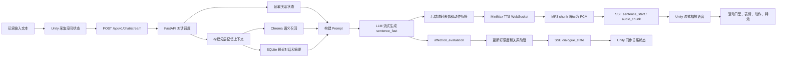

这篇文章记录我目前这个 AI 虚拟人项目的整体设计与开发过程。项目不是一个普通聊天窗口，而是一个面向 Unity 角色互动场景的本地 AI 对话系统：玩家输入一句话，角色会根据空间距离、关系状态和长期记忆返回文本与语音，做出表情、动作、脸部特效等表现，还会根据玩家输入来判断好感度变化。

我把这篇文章分成三个部分：整体篇负责讲清楚项目目标和完整链路；后端篇负责讲 FastAPI 如何编排 LLM、TTS、记忆和关系状态；Unity 篇负责讲客户端如何接收流式事件，并把它们变成角色的可见表现。

版权声明：本项目使用了米哈游的模型以及部分动画。

# 整体篇

## 项目定位

这个项目的目标是做一个更接近“虚拟角色”的 AI 交互系统，而不是只做一个能回答问题的聊天机器人，我想要她可以与玩家进行更多的交互。

在普通聊天系统里，一次对话通常只有两个核心数据：玩家输入的文本，以及模型返回的文本。但在虚拟人场景里，角色还需要有身体表现、语音表现、关系记忆和环境感知。玩家站得太近、是否看着角色、双方当前关系怎样、之前聊过什么，这些信息都应该影响角色的反应。

所以我给项目定下的核心目标是：

* 角色能实时回复玩家，而不是等完整音频生成完才开始说话。
* 回复不仅包含文本，还包含语音、表情、身体动作和脸部特效。
* 角色能根据玩家距离、方位、注视状态做出空间反应。
* 角色有长期记忆，不会每一轮都像第一次见面。
* 角色有好感度和关系阶段，不同关系下的语气和行为不同。
* 除了能与角色对话之外还能进行更多的交互，比如玩家可以牵着角色的手一起去看风景，也可以和角色一起去看电影等等。
* 角色也可以主动邀请玩家，比如主动提出约会邀约，在吃饭时主动喂玩家吃饭之类的。

这也是为什么这个项目不能简单按“前端页面 + 后端接口”的方式理解。它更像是一个由 Unity 客户端和 Python AI 后端共同完成的实时角色驱动系统。

## 为什么要分成 Unity 客户端和 AI 后端

Unity 端负责“表现”：玩家输入、空间检测、SSE 接收、音频播放、口型、表情、动作、凝视、好感度 UI 和调试面板。

Python 后端负责“编排”：接收玩家输入和空间状态，读取记忆与关系状态，构建 Prompt，调用 LLM，解析结构化的json输出，调用 MiniMax TTS，把音频转换成 Unity 可流式播放的 PCM，再通过 SSE 返回。

两边的分工大致如下：

| 模块                             | 主要职责                          |
| ------------------------------ | ----------------------------- |
| Unity 客户端                      | 采集玩家输入、空间状态、播放语音、驱动角色表现       |
| FastAPI 后端                     | 对话主流程、LLM 调用、TTS 调度、记忆召回、关系系统 |
| SSE 协议                         | 把句子、音频块和关系状态从后端持续推给 Unity     |
| Chroma / SQLite                | 保存长期记忆、最近对话和摘要                |
| MiniMax / DeepSeek / DashScope | 分别负责语音、文本生成和语义向量              |

这种结构的好处是：Unity 不需要直接接触多个 AI 服务，也不需要承担复杂的 Prompt 和记忆逻辑；后端也不需要知道具体模型怎么播放动画，只要输出稳定的表现标签即可。

至于为什么要用轻量化的数据库，是因为我的项目当前主要是单机或小规模原型验证场景，核心数据包括玩家好感度、关系状态、空间事件和部分对话行为日志。这些数据量不大，但需要低延迟、易调试、易部署。因此我选择轻量化数据库来存储结构化状态数据，降低系统复杂度，同时把语义记忆交给 Chroma 这类向量数据库处理。后续如果项目扩展到多用户、云端同步或高并发场景，可以再迁移到 PostgreSQL 或 MySQL。

## 整体架构

项目整体链路可以概括成下面这样：



从体验上看，玩家只是在和角色说一句话；但系统内部实际跑过了空间感知、记忆召回、LLM 生成、TTS 流式合成、PCM 解码、SSE 推送、Unity 音频缓冲和角色表现驱动这一整条链路。

虽然项目没有采用端到端架构，但我通过优化后端链路和流式处理流程，将首句延迟控制在两秒左右，并且没有明显牺牲回复质量。

#### 什么是端到端架构？

端到端架构，英文为 End-to-End Architecture，通常指系统从输入到最终输出之间，尽量由一个统一的模型、服务或流程直接完成任务，中间减少人工设计的规则、模块拆分和显式干预。

简单来说，端到端强调的是：

```
输入 → 系统整体处理 → 输出

```

在这种架构中，开发者通常不需要把任务拆分成很多独立模块，也不需要为每个中间环节单独设计大量规则。系统会尽可能直接地从原始输入中学习或处理信息，并生成最终结果。

例如，在语音识别任务中，传统流程可能会先提取音频特征，再进行声学建模、语言建模，最后输出文本；而端到端语音识别则倾向于让模型直接从音频输入生成文字结果。再比如在 AI 对话系统中，用户输入一句话后，系统直接生成回复内容，也可以看作一种端到端处理方式。

端到端架构的优势在于链路较短，系统结构表面上更加简洁，可以减少多个模块之间的数据传递、接口适配和中间格式转换成本。由于输入可以更直接地进入核心生成流程，系统不需要等待多个子模块依次完成处理，因此在首句延迟方面通常也更有优势。对于实时对话、语音交互、虚拟人等场景来说，首句响应速度会直接影响用户对“实时性”和“自然交流感”的感知，所以端到端架构在低延迟交互场景中具有一定吸引力。

如果模型能力足够强，端到端系统还可能生成更加统一、自然的结果，因为它不需要在多个模块之间反复转换语义信息，整体输出的一致性可能更好。

不过，端到端架构也存在一定局限。由于中间过程通常不够透明，系统的可解释性和可控性会相对较弱。当输出结果出现问题时，开发者可能难以准确判断问题来自哪一个环节。同时，如果某些业务需要对中间状态进行精细控制，完全端到端的方式也可能不够灵活。

因此，端到端架构并不等于绝对更先进，它更适合输入和输出目标明确、任务边界清晰，并且可以通过大量数据训练或优化的场景。而对于需要强可控性、强可解释性或复杂业务逻辑的系统，模块化架构有时会更加合适。

总体来说，端到端架构是一种强调“从输入直接到输出”的系统设计思路，它追求流程简化和整体优化，但在可控性、可解释性和调试便利性方面需要结合具体业务场景进行权衡。

#### 为什么我没有采用完全端到端架构？

我没有采用完全端到端架构，主要是因为当前项目的核心目标并不只是让 AI 生成一段回复文本，而是希望构建一个能够驱动角色表现和关系状态变化的实时 AI 虚拟角色系统。

在这个项目中，后端不仅需要完成记忆检索、Prompt 构建、LLM 生成和 TTS 合成，还需要根据好感度、情绪、空间状态等信息生成结构化结果；前端则需要根据这些结构化数据进一步调度角色的口型、表情、动作、脸部特效和空间行为反馈。如果将所有流程完全端到端地封装起来，中间状态会变得更加黑盒，不利于对角色表现进行精细控制，也不利于后续调试和功能扩展。

因此，我选择了更偏模块化的系统架构：后端负责记忆检索、关系判断、对话生成、语音合成和结构化数据输出；Unity 前端负责解析 JSON 数据，并根据其中的情绪、动作、语音参数和空间状态信息完成角色表现调度。这样的设计虽然让链路相对更长，但每个模块都可以被单独调试、替换和优化。

在实际优化中，我也对首句延迟进行了针对性处理。虽然项目没有采用完全端到端架构，但目前已经将首句延迟优化到两秒左右，并且没有明显牺牲回复质量，基本满足实时交互场景下的体验需求。

从长期来看，这种模块化架构也为项目后续拓展留下了空间。当前项目并不是一个封闭的一次性 Demo，而是一个可继续扩展的实时 AI 角色交互框架。后续既可以继续向 Unity 前端表现层拓展，例如增加角色主动发起对话、根据玩家距离和状态触发不同反应、实现递食物或投喂等更具沉浸感的 VR 互动；也可以向后端智能体能力拓展，例如加入任务拆解、工具调用、状态管理和长期记忆管理，使角色逐步具备类似 AI Agent 的行为能力。

如果未来需要进一步强化复杂任务执行能力，也可以在现有后端架构基础上引入 LangChain、LangGraph 等框架，用于管理工具调用、多步骤任务流程和状态流转。但这并不是当前系统必须立即重构的方向，而是后续可选的演进路线之一。

因此，我认为当前架构的价值不只在于实现了 AI 对话、TTS 播放和 Unity 表现调度，而在于搭建了一个可控、可调试、可扩展的 AI 虚拟角色系统底座。它既能继续向前端的空间交互、行为调度和情感演出拓展，也能向后端的记忆系统、任务规划和 Agent 化能力拓展。

## 一次完整对话是怎么发生的

一次对话从 Unity 发起。请求体里不仅有玩家说的话，还有当前空间状态：

```json
{
  "user_id": "player_01",
  "message": "你可以跟我交往吗？",
  "spatial_state": {
    "distance": 2.31,
    "distance_zone": "attention",
    "relative_position": "front",
    "gaze_duration": 10.14,
    "spatial_event": "none",
    "spatial_reaction_state": "idle"
  }
}
```

后端收到请求后，会先加载玩家的关系状态，比如好感度、关系阶段、当前态度、连续正向或负向互动次数。然后构建分层记忆上下文，把手动设定、自动提取设定、最近对话、语义召回结果和历史摘要一起放进 Prompt。

LLM 不是一次性输出完整回复，而是按 JSONL 逐行输出 `sentence_fast`：

```json
{
  "type": "sentence_fast",
  "index": 1,
  "text": "又突然说这种话，你还真是不按常理来。",
  "emotion": "doubt",
  "intensity": 0.6,
  "tts": { "speed": 1.0, "vol": 1.0, "pitch": 0 }
}
```

后端一旦解析到第一句，就立刻启动 TTS。TTS 返回的音频块会被后端解码成 `pcm_s16le`，第一个可播放音频块到达后，后端立即发送 `sentence_start`：

```json
{
  "type": "sentence_start",
  "index": 1,
  "text": "又突然说这种话，你还真是不按常理来。",
  "audio_base64": "...",
  "chunk_index": 1,
  "format": "pcm_s16le",
  "sample_rate": 32000,
  "channels": 1,
  "is_final": false,
  "emotion": "doubt",
  "expression": "Doubt",
  "body_action": "DoubtGesture",
  "face_effect": "none"
}
```

Unity 收到 `sentence_start` 后，不需要等整句音频结束生成，就可以开始播放第一块音频，同时驱动角色表情和动作。后续音频继续通过 `audio_chunk` 追加：

```json
{
  "type": "audio_chunk",
  "index": 1,
  "chunk_index": 2,
  "audio_base64": "...",
  "format": "pcm_s16le",
  "sample_rate": 32000,
  "channels": 1,
  "is_final": false
}
```

本轮对话结束后，后端再发送关系状态：

```json
{
  "type": "dialogue_state",
  "affection_value": 73,
  "relationship_stage": "close",
  "affection_delta": 0,
  "relationship_attitude": "stable",
  "interaction_count": 12,
  "dialogue_mood": "doubt"
}
```

这样一轮对话就同时完成了三件事：角色说出了话，角色做出了表情动作，双方关系状态也被同步更新。

## 这个项目最核心的难点

最难的地方不是单独调用 LLM，也不是单独播放音频，而是把很多异步系统组合成一个顺滑的实时体验。

LLM 是流式的，TTS 是流式的，Unity 音频播放也要流式缓冲。任何一个环节慢一点，玩家感受到的就是角色迟迟不开口。任何一个环节输出不稳定，Unity 端就可能出现表情标签找不到、音频格式不对、动作状态不退出等问题。

所以这个项目的关键不是“让模型回答”，而是“让角色自然地开始说话，并且说话时身体也像一个角色”。

# 后端篇

## 后端目录结构

后端项目基于 FastAPI，主要目录如下：

```text
sparkle_backend
├─ api/
│  ├─ chat_router.py              # 对话 SSE 接口
│  ├─ memory_router.py            # 长期记忆管理接口
│  └─ relationship_router.py      # 关系状态管理接口
├─ core/
│  └─ config.py                   # 环境变量和本地配置
├─ models/
│  └─ schemas.py                  # 请求模型
├─ services/
│  ├─ dialogue_stream_service.py  # 对话主流程和 SSE 输出
│  ├─ minimax_llm.py              # LLM 流式调用
│  ├─ minimax_tts_ws.py           # MiniMax TTS WebSocket 连接池
│  ├─ minimax_tts.py              # HTTP TTS fallback
│  ├─ memory_service.py           # Chroma + DashScope embedding
│  ├─ memory_context_builder.py   # 分层记忆上下文构建
│  ├─ recent_dialogue_service.py  # SQLite 最近对话和摘要数据
│  ├─ dialogue_summary_service.py # 对话摘要和记忆提取
│  ├─ relationship_service.py     # 好感度和关系状态
│  ├─ prompt_builder.py           # Prompt 构建
│  └─ http_client_service.py      # 共享 httpx.AsyncClient
├─ chroma_memory_db/              # Chroma 本地向量库
├─ data/                          # SQLite 和关系状态数据
└─ main.py                        # FastAPI 入口
```

其中最核心的是 `dialogue_stream_service.py`。它相当于整个后端的调度器：一边消费 LLM 的 JSONL 输出，一边创建 TTS 任务，一边把可播放的音频块按顺序通过 SSE 发给 Unity。

## 请求入口：SSE 流式对话接口

对话入口是：

```text
POST /api/v1/chat/stream
```

`api/chat_router.py` 做的事情很简单：接收 `ChatRequest`，取出 `user_id`、`message` 和 `spatial_state`，然后返回 `StreamingResponse`。

真正的逻辑放在 `process_chat_stream()` 里。这样设计的好处是 API 层很薄，复杂的业务流程都集中在 service 层，后续要调试性能、替换模型或调整协议时，不需要改路由代码。

## Prompt 设计：让 LLM 先说第一句

为了降低首包延迟，Prompt 里明确要求 LLM 使用 JSONL 输出，并且第一行必须马上输出 `index=1` 的 `sentence_fast`，不要等完整规划。

这和普通“请你生成一段回复”的思路不一样。普通回复适合完整文本，但不适合实时语音角色，因为完整文本出来之前，TTS 不能启动，Unity 也不能开始播放。

我的做法是把 LLM 输出拆成两类：

* `sentence_fast`：立刻可说的一句话，包含文本、情绪、强度和 TTS 参数。
* `affection_evaluation`：所有句子输出后，再给出本轮互动对关系的影响。

也就是说，文本和表演先走，关系评估可以稍后走。这样玩家会更快听到角色开口，而不必等完整评估结束。

## 表现标签由后端稳定映射

LLM 只负责输出 `emotion` 和 `intensity`，不直接决定 Unity 里的具体动画资源。后端会把情绪映射成稳定的表现标签：

| emotion  | expression | body\_action | face\_effect |
| -------- | ---------- | ------------ | ------------ |
| neutral  | Default    | None         | none         |
| soft     | Soft       | SoftTalk     | none         |
| happy    | Happy      | HappyGesture | none         |
| shy      | Shy        | ShyGesture   | blush        |
| thinking | Thinking   | Thinking     | none         |
| angry    | Angry      | AngryGesture | shadow       |
| doubt    | Doubt      | DoubtGesture | none         |

这样做可以降低 Unity 端复杂度。Unity 不需要猜模型输出是什么意思，只需要根据固定枚举执行对应表情和动作。同时，后端还可以根据关系状态做二次修正，比如低好感阶段遇到亲密推进时，强制把害羞或开心表现改成警惕、怀疑或生气。

当然，这样处理也是为了尽可能压缩系统提示词，减少大模型在生成表现标签时的判断负担。部分表现逻辑由程序侧承担后，模型无需在每次回复中都重新考虑所有标签，从而降低推理成本并减少响应延迟。

## 分层记忆系统

这个项目的记忆不是简单把所有历史对话塞进 Prompt。那样会越来越长，也容易把无关内容召回进来。

目前后端把记忆分成几层：

| 记忆层    | 数据来源                         | 用途                    |
| ------ | ---------------------------- | --------------------- |
| 手动设定   | Chroma                       | 最高优先级，保存角色设定或用户手动指定内容 |
| 自动提取设定 | Chroma                       | 从历史对话中总结出的长期信息        |
| 最近对话   | SQLite                       | 保留最近若干轮上下文，保证话题连续     |
| 语义召回   | Chroma + DashScope embedding | 根据当前输入召回相关长期记忆        |
| 历史摘要   | SQLite / Chroma              | 压缩更早的对话，避免上下文无限增长     |

`memory_context_builder.py` 会并发构建这些上下文，并设置超时时间。这样即使某一层记忆读取失败，也不会让整轮对话完全卡死。

语义召回使用 DashScope embedding 和 Chroma。优化后，多类型记忆召回会尽量只做一次 query embedding，然后按多个 `memory_type` 查询，不再为每种记忆类型重复请求外部 embedding 服务。

## 最近对话和摘要

最近对话保存在 SQLite 中，主要解决“接住刚才话题”的问题。和向量召回相比，最近对话不需要做语义搜索，顺序也更稳定。

历史摘要则用于压缩更早的内容。对话轮数增加后，系统会在后台触发摘要任务，把若干轮对话发送给大模型，让大模型总结成更短的长期信息，同时提取可能有长期价值的记忆，比如玩家偏好、关系事件、项目设定等。

这样设计后，Prompt 里既有短期连续性，也有长期记忆，还能避免把所有原始对话无限堆进去。

## 关系系统：好感度不是一个数字而已

后端的关系系统不只是维护 `affection_value`。它还会根据数值映射关系阶段：

| 好感度范围    | 关系阶段     |
| -------- | -------- |
| 0 - 19   | distant  |
| 20 - 39  | stranger |
| 40 - 59  | familiar |
| 60 - 79  | close    |
| 80 - 100 | intimate |

除此之外，系统还维护连续正向、负向和中性互动次数，并据此调整 `relationship_attitude`。例如连续负向互动可能让角色进入 `cold` 状态，连续正向互动可能进入 `interested` 状态。

这比单纯的数值变化更适合角色表现。因为同样是 50 点好感，如果刚刚连续发生了负向互动，角色应该明显更冷淡，并且更加不容易增加好感度；如果刚刚连续发生正向互动，角色则可以表现得更愿意靠近，且此时增加好感度更加容易。

关系系统还参与表现约束。比如低好感阶段，如果玩家突然提出亲密要求，后端会把这类输入识别为边界压力，不让角色输出过于甜蜜的回应。这能避免“数值还很低，但角色突然变得很亲密”的违和感。

## TTS 流式语音

语音部分使用 MiniMax TTS WebSocket。当后端启动时会初始化一个 WebSocket 连接池，默认配置为 4 个连接，用来并发处理多句 `sentence_fast` 的语音合成任务。每当 LLM 输出一句 `sentence_fast`，后端就会创建一个 TTS 任务，把这句话发送给 MiniMax。

MiniMax WebSocket 返回的音频数据并不是直接可播放的 PCM，而是 **hex 字符串形式的 MP3 音频片段**。后端收到后，会先通过 `bytes.fromhex()` 还原成 MP3 bytes，再使用 `miniaudio` 做增量解码，将 MP3 音频流转换成 `pcm_s16le` 格式的 PCM 数据。

之所以不直接把 MiniMax 返回的 hex 转成 base64 发给 Unity，是因为那样传过去的本质仍然是 MP3 数据，Unity 端还需要再处理 MP3 流式解码。当前项目选择在后端完成解码，把更容易播放的 PCM 数据交给 Unity。这样 Unity 端只需要把 base64 还原成 PCM 样本，并写入流式播放缓冲即可。

整体流程是：

```text
sentence_fast -> TTS WebSocket -> MP3 hex -> MP3 bytes -> PCM chunk -> base64 -> SSE -> Unit
```

第一个 PCM chunk 到达后，后端马上发送 `sentence_start`。后续 chunk 通过 `audio_chunk` 继续发送。等一句话的音频结束，再发送 `is_final=true` 的空 chunk，告诉 Unity 这一句已经结束。

## SSE 协议设计

目前后端主要向 Unity 返回三类事件。

#### sentence\_start

`sentence_start` 表示一句话可以开始播放了。它包含文本、第一块音频、情绪、表情、身体动作、脸部特效等信息。

Unity 收到这个事件后，会做三件事：把句子放入播放队列，把第一块音频写入流式缓冲，立刻驱动角色表现。

#### audio\_chunk

`audio_chunk` 是同一句话后续的音频块。它只关心音频，不重复发送表情和动作标签。

这样设计可以减少冗余，也能让 Unity 端把“句子表现”和“音频追加”分开处理。

#### dialogue\_state

`dialogue_state` 在本轮对话结束时发送，包含好感度、关系阶段、变化原因、连续互动次数和当前态度。

Unity 的 `AffectionSystem` 会同步这份状态，后续空间反应、对话结束后的表情保持策略、调试面板显示都可以使用它。

## 首包延迟优化

这个项目做过几轮针对首包延迟的优化。因为虚拟人对话里，玩家最敏感的是“角色多久开始说第一句话”。

主要优化包括：

* TTS 从完整音频返回改为第一个可播放 chunk 到达即返回。
* MiniMax TTS 从 HTTP 调用切到 WebSocket 长连接池。
* 后端把 MP3 chunk 解码成 Unity 可直接消费的 PCM chunk。
* 记忆召回从多次 embedding 优化为一次 embedding 后多类型查询。
* LLM 和 DashScope embedding 请求复用共享 `httpx.AsyncClient`。
* 降低系统提示词复杂度，减少模型每次生成时需要理解和输出的内容量。
* 关系评估放到句子输出之后，不阻塞第一句话开始播放。

在最后一次实测中，首条可播放 SSE 响应时间从约 `4.6s` 优化到约 `2.1s`。其中，记忆检索耗时从约 `1.7s` 降至约 `0.36s`，DashScope embedding 耗时从约 `1.28s` 降至约 `0.35s`。经过优化后，检索与前置处理耗时已明显下降，当前主要瓶颈转移到了大模型推理速度上。

#### 优化历程：（还没写）

这个优化过程让我意识到，AI 应用里的“快”不一定是总耗时最短，而是用户最早能感知到有效反馈。对虚拟人来说，只要第一句话和第一段音频先出来，后面的内容可以继续流式补齐。

## 当前后端限制

当前后端主要面向本地学习和实验运行，还没有按公网服务标准设计完整安全策略。

比较明显的限制有：

* 本地接口暂时没有完整鉴权和多租户隔离。
* 记忆召回依赖外部 embedding 服务，网络质量会影响首包延迟。
* TTS WebSocket 连接池对稳定性要求较高，异常恢复还可以继续加强。
* LLM 输出虽然有结构化约束，但仍需要后端做容错和标签归一化。
* `.env` 里的真实密钥必须只保存在本地，不能提交到公开仓库。

# Unity 篇

## Unity 脚本结构

Unity 前端脚本路径是：

```text
D:\hlrn134\Galgame_Huohuahua\Assets\Scripts
```

目前主要分成这些目录：

```text
Assets/Scripts
├─ Character/  # 角色表现：表情、动作、口型、朝向、凝视、脸部特效
├─ Core/       # 数据结构、接口和工具类
├─ Debug/      # 调试面板
├─ Dialogue/   # 对话播放和音频解码
├─ Network/    # 后端请求、SSE 接收、关系接口
├─ Player/     # 玩家控制
└─ Systems/    # 好感系统、空间感知、情绪解析等系统逻辑
```

Unity 侧的核心任务是把后端发来的抽象事件变成具体表现。后端不会直接控制 Animator，也不会知道场景中的模型结构。它只发出 `expression=Shy`、`body_action=HappyGesture`、`face_effect=blush` 这样的标签。Unity 端再根据这些标签驱动具体组件。

## 网络层：接收 SSE 事件

网络层主要由 `PythonSSEChatService.cs` 和 `SSEDownloadHandler.cs` 负责。

`PythonSSEChatService` 实现了 `IChatService`。它会把玩家输入和当前空间状态序列化成 JSON，然后用 `UnityWebRequest` 请求后端的 `/api/v1/chat/stream`。

`SSEDownloadHandler` 继承自 `DownloadHandlerScript`，它不会等整个响应结束，而是在 `ReceiveData` 中持续接收字节流。每当缓冲区里出现完整的 SSE 事件，就取出 `data: ...` 后面的 JSON 内容，交给 `PythonSSEChatService` 解析。

解析后的事件会转换成 Unity 内部事件：

* `OnSentenceStreamStarted`
* `OnAudioChunkReceived`
* `OnSentenceReceived`
* `OnDialogueStateReceived`
* `OnRequestStarted`
* `OnRequestFinished`
* `OnRequestError`

这样播放层和表现层不需要知道 SSE 字符串怎么解析，只需要订阅 C# 事件。

## 播放层：流式 PCM 音频

`DialoguePlaybackController.cs` 是 Unity 侧播放链路的核心。

它负责维护句子队列和每个句子的流式音频缓冲。当收到 `sentence_start` 时，它会创建或找到对应的 `StreamingSentenceBuffer`，把第一块 PCM 样本写进去，并把句子放入播放队列。

当收到后续 `audio_chunk` 时，它会继续把 base64 解码成 PCM 样本，转换成 `float`，追加到缓冲队列。

播放时，Unity 使用 `AudioClip.Create` 创建一个流式 AudioClip，并通过回调不断从缓冲区读取样本。这样做的好处是：音频还没全部到达时，角色就可以先开口。

为了避免播放过程中断，播放层还做了几个缓冲策略：

* 开始播放前等待一个很短的起播缓冲。
* 缓冲低于低水位时暂停 AudioSource。
* 后续数据补到恢复水位后继续播放。
* 如果等待过久，就按超时逻辑结束当前句子。
* 如果后端发送了 legacy WAV fallback，则可以切回完整音频播放。

这些细节看起来偏底层，但它们直接决定了虚拟人说话是否顺滑。

## 角色表现层：文本不是唯一输出

`CharacterPerformanceController.cs` 负责把一句话的表现数据真正应用到角色身上。

当 `DialoguePlaybackController` 触发 `OnSentenceStarted` 时，表现层会同时做几件事：

* 根据 `expression` 设置角色表情。
* 根据 `body_action` 播放身体动作。
* 根据 `face_effect` 触发脸部特效。
* 启动口型同步。
* 根据文本和拼音声母做开头口型提示。

这也是这个项目和普通聊天界面的最大区别。玩家看到的不是一段文字，而是一个角色带着表情和动作说出这句话。

我把表现标签设计成后端输出、Unity 执行的形式，是为了让角色表现更稳定。比如后端输出 `DoubtGesture`，Unity 只需要把它解析成 `BodyActionId.DoubtGesture`，然后交给 `BodyMotionController` 播放对应动作。

## 口型同步

`MouthSyncController.cs` 使用 AudioSource 的输出数据来估算音量幅度，并根据幅度切换口型状态。

当前口型状态包括：

| 状态      | 含义        |
| ------- | --------- |
| Default | 默认闭口或自然状态 |
| EState  | 较小开口      |
| AState  | 中等开口      |
| OState  | 较大圆口      |
| NState  | 收尾闭合状态    |

为了避免口型抖动，系统做了平滑和状态保持。音量上升和下降使用不同速度，口型切换也有最短保持时间。

此外，`CharacterPerformanceController` 还会在句子开头根据拼音声母做一些强制口型提示。例如 `b`、`p`、`m` 更容易触发短暂闭口，`h` 可以触发更接近 E 的口型。这样可以弥补单纯音量驱动在句子开头不够准确的问题。

## 空间感知：玩家站在哪里也会影响角色

`SpatialPerceptionSensor.cs` 负责采集玩家和角色之间的空间状态。它会周期性计算：

* 玩家距离角色多远。
* 玩家处于 `far`、`attention`、`personal` 还是 `too_close` 区域。
* 玩家在角色前方、后方、左侧还是右侧。
* 玩家是否正在看着角色。
* 玩家在当前区域停留了多久。
* 是否发生了进入过近、离开过近等空间事件。

这些信息会被放进下一次对话请求的 `spatial_state` 中。后端 Prompt 会根据这些状态调整回复。例如玩家距离过近时，低好感角色应该更警惕；高好感角色可能会害羞；如果当前已经处于 `too_close_reaction`，后端也知道角色正在做空间躲避动作。

## 空间反应：不说话时角色也应该有反应

`SpatialReactionController.cs` 负责非对话状态下的空间反应。

如果玩家进入 `too_close` 区域，角色会根据关系阶段做不同表现：

* `distant` 或 `stranger`：更紧张、怀疑，可能出现 `shadow` 特效。
* `familiar`：偏惊讶或正常提醒。
* `close` 或 `intimate`：更可能害羞，出现 `blush` 或 `shy_blush`。

空间反应还会使用身体动作锁。比如过近时播放 `Avoid` 动作，普通对话动作不能立刻覆盖它。等玩家离开过近区域后，再延迟恢复默认表情、退出空间动作并清空脸部特效。

这个机制让角色不只是在“说话时活着”，在玩家靠近、离开、注视时也会有状态变化。

## 好感系统同步

Unity 侧的 `AffectionSystem.cs` 会同步后端发来的 `dialogue_state`。它本地保存：

* `affectionValue`
* `relationshipStage`
* `lastDelta`
* `lastReason`
* `interactionCount`
* `positiveStreak`
* `negativeStreak`
* `neutralStreak`
* `relationshipAttitude`
* `attitudeTurnsRemaining`

这些状态不仅用于 UI 显示，也会影响角色的空间反应和对话结束后的表现保持策略。

例如在 `close` 或 `intimate` 阶段，角色说完话后可以更久地保持最后的柔和表情或身体动作；如果本轮好感下降，角色会更快退出亲近表现；如果进入 `cold` 状态，则会降低停留感，恢复得更快。

## 调试面板和工程化价值

项目里还保留了 `Debug` 目录，比如聊天调试面板和好感度调试面板。这类工具对开发很重要，因为 AI 虚拟人的问题很难只靠代码日志判断。

一次角色表现异常，可能来自很多环节：

* 后端没有发正确的 `expression`。
* Unity 枚举里没有对应动作。
* SSE 解析丢了某个字段。
* 音频缓冲 underrun。
* 好感状态没有同步。
* 空间动作锁挡住了普通动作。

有调试面板后，可以更快判断问题发生在哪一层。

## Unity 侧当前可以继续改进的地方

Unity 端已经能完成流式接收、播放和角色表现，但后续还有很多可以继续打磨的地方：

* 表情和动作之间可以增加更自然的过渡。
* 口型可以从音量驱动升级到更精细的音素驱动。
* 空间感知可以加入更多场景事件，比如玩家绕后、长时间凝视、突然靠近。
* 好感度变化可以有更明确的 UI 反馈。
* 调试面板可以显示每轮 SSE 原始事件和播放缓冲状态。
* 角色动作资源可以继续扩充，减少不同情绪复用同一动作的情况。

## 总结

这个项目最有价值的部分，不是简单把 LLM 接进 Unity，而是把文本生成、语音流、角色表现、空间感知、长期记忆和关系系统串成了一条完整链路。

后端负责把玩家输入变成结构化、可播放、可表演的事件流；Unity 负责把这些事件变成玩家能感受到的角色行为。两边之间靠 SSE 协议连接，既保证实时性，也让模块边界比较清晰。

后续如果继续优化，我会优先关注三件事：第一是进一步降低首句开口延迟；第二是让关系和记忆更稳定地影响角色表现；第三是让 Unity 端的表情、动作、口型过渡更自然。这样角色才会越来越不像一个“会说话的接口”，而更像一个有状态、有距离感、有记忆的虚拟人。
