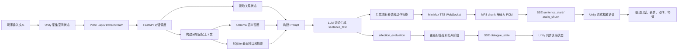

这篇文章记录我目前这个 AI 虚拟人项目的整体设计与开发过程。项目不是一个普通聊天窗口，而是一个面向 Unity 角色互动场景的本地 AI 对话系统：玩家输入一句话，角色会根据空间距离、关系状态和长期记忆返回文本与语音，做出表情、动作、脸部特效等表现，还会根据玩家输入来判断好感度变化。

我把这篇文章分成三个部分：整体篇负责讲清楚项目目标和完整链路；后端篇负责讲 FastAPI 如何编排 LLM、TTS、记忆和关系状态；Unity 篇负责讲客户端如何接收流式事件，并把它们变成角色的可见表现。

版权声明：本项目使用了米哈游的模型以及部分动画。

# 整体篇

## 项目定位

这个项目的目标是做一个更接近“虚拟角色”的 AI 交互系统，而不是只做一个能回答问题的聊天机器人，我想要她可以与玩家进行更多的交互。

在普通聊天系统里，一次对话通常只有两个核心数据：玩家输入的文本，以及模型返回的文本。但在虚拟人场景里，角色还需要有身体表现、语音表现、关系记忆和环境感知。玩家站得太近、是否看着角色、双方当前关系怎样、之前聊过什么，这些信息都应该影响角色的反应。

所以我给项目定下的核心目标是：

- 角色能实时回复玩家，而不是等完整音频生成完才开始说话。
- 回复不仅包含文本，还包含语音、表情、身体动作和脸部特效。
- 角色能根据玩家距离、方位、注视状态做出空间反应。
- 角色有长期记忆，不会每一轮都像第一次见面。
- 角色有好感度和关系阶段，不同关系下的语气和行为不同。
- 除了能与角色对话之外还能进行更多的交互，比如玩家可以牵着角色的手一起去看风景，也可以和角色一起去看电影等等。
- 角色也可以主动邀请玩家，比如主动提出约会邀约，在吃饭时主动喂玩家吃饭之类的。

这也是为什么这个项目不能简单按“前端页面 + 后端接口”的方式理解。它更像是一个由 Unity 客户端和 Python AI 后端共同完成的实时角色驱动系统。

## 为什么要分成 Unity 客户端和 AI 后端

Unity 端负责“表现”：玩家输入、空间检测、SSE 接收、音频播放、口型、表情、动作、凝视、好感度 UI 和调试面板。

Python 后端负责“编排”：接收玩家输入和空间状态，读取记忆与关系状态，构建 Prompt，调用 LLM，解析结构化的json输出，调用 MiniMax TTS，把音频转换成 Unity 可流式播放的 PCM，再通过 SSE 返回。

两边的分工大致如下：

| 模块                           | 主要职责                                           |
| ------------------------------ | -------------------------------------------------- |
| Unity 客户端                   | 采集玩家输入、空间状态、播放语音、驱动角色表现     |
| FastAPI 后端                   | 对话主流程、LLM 调用、TTS 调度、记忆召回、关系系统 |
| SSE 协议                       | 把句子、音频块和关系状态从后端持续推给 Unity       |
| Chroma / SQLite                | 保存长期记忆、最近对话和摘要                       |
| MiniMax / DeepSeek / DashScope | 分别负责语音、文本生成和语义向量                   |

这种结构的好处是：Unity 不需要直接接触多个 AI 服务，也不需要承担复杂的 Prompt 和记忆逻辑；后端也不需要知道具体模型怎么播放动画，只要输出稳定的表现标签即可。

至于为什么要用轻量化的数据库，是因为我的项目当前主要是单机或小规模原型验证场景，核心数据包括玩家好感度、关系状态、空间事件和部分对话行为日志。这些数据量不大，但需要低延迟、易调试、易部署。因此我选择轻量化数据库来存储结构化状态数据，降低系统复杂度，同时把语义记忆交给 Chroma 这类向量数据库处理。后续如果项目扩展到多用户、云端同步或高并发场景，可以再迁移到 PostgreSQL 或 MySQL。

## 整体架构

项目整体链路可以概括成下面这样：



从体验上看，玩家只是在和角色说一句话；但系统内部实际跑过了空间感知、记忆召回、LLM 生成、TTS 流式合成、PCM 解码、SSE 推送、Unity 音频缓冲和角色表现驱动这一整条链路。

虽然项目没有采用端到端架构，但我通过优化后端链路和流式处理流程，将首句延迟控制在两秒左右，并且没有明显牺牲回复质量。

#### 什么是端到端架构？

端到端架构，英文为 End-to-End Architecture，通常指系统从输入到最终输出之间，尽量由一个统一的模型、服务或流程直接完成任务，中间减少人工设计的规则、模块拆分和显式干预。

简单来说，端到端强调的是：

```
输入 → 系统整体处理 → 输出

```

在这种架构中，开发者通常不需要把任务拆分成很多独立模块，也不需要为每个中间环节单独设计大量规则。系统会尽可能直接地从原始输入中学习或处理信息，并生成最终结果。

例如，在语音识别任务中，传统流程可能会先提取音频特征，再进行声学建模、语言建模，最后输出文本；而端到端语音识别则倾向于让模型直接从音频输入生成文字结果。再比如在 AI 对话系统中，用户输入一句话后，系统直接生成回复内容，也可以看作一种端到端处理方式。

端到端架构的优势在于链路较短，系统结构表面上更加简洁，可以减少多个模块之间的数据传递、接口适配和中间格式转换成本。由于输入可以更直接地进入核心生成流程，系统不需要等待多个子模块依次完成处理，因此在首句延迟方面通常也更有优势。对于实时对话、语音交互、虚拟人等场景来说，首句响应速度会直接影响用户对“实时性”和“自然交流感”的感知，所以端到端架构在低延迟交互场景中具有一定吸引力。

如果模型能力足够强，端到端系统还可能生成更加统一、自然的结果，因为它不需要在多个模块之间反复转换语义信息，整体输出的一致性可能更好。

不过，端到端架构也存在一定局限。由于中间过程通常不够透明，系统的可解释性和可控性会相对较弱。当输出结果出现问题时，开发者可能难以准确判断问题来自哪一个环节。同时，如果某些业务需要对中间状态进行精细控制，完全端到端的方式也可能不够灵活。

因此，端到端架构并不等于绝对更先进，它更适合输入和输出目标明确、任务边界清晰，并且可以通过大量数据训练或优化的场景。而对于需要强可控性、强可解释性或复杂业务逻辑的系统，模块化架构有时会更加合适。

总体来说，端到端架构是一种强调“从输入直接到输出”的系统设计思路，它追求流程简化和整体优化，但在可控性、可解释性和调试便利性方面需要结合具体业务场景进行权衡。

#### 为什么我没有采用完全端到端架构？

我没有采用完全端到端架构，主要是因为当前项目的核心目标并不只是让 AI 生成一段回复文本，而是希望构建一个能够驱动角色表现和关系状态变化的实时 AI 虚拟角色系统。

在这个项目中，后端不仅需要完成记忆检索、Prompt 构建、LLM 生成和 TTS 合成，还需要根据好感度、情绪、空间状态等信息生成结构化结果；前端则需要根据这些结构化数据进一步调度角色的口型、表情、动作、脸部特效和空间行为反馈。如果将所有流程完全端到端地封装起来，中间状态会变得更加黑盒，不利于对角色表现进行精细控制，也不利于后续调试和功能扩展。

因此，我选择了更偏模块化的系统架构：后端负责记忆检索、关系判断、对话生成、语音合成和结构化数据输出；Unity 前端负责解析 JSON 数据，并根据其中的情绪、动作、语音参数和空间状态信息完成角色表现调度。这样的设计虽然让链路相对更长，但每个模块都可以被单独调试、替换和优化。

在实际优化中，我也对首句延迟进行了针对性处理。虽然项目没有采用完全端到端架构，但目前已经将首句延迟优化到两秒左右，并且没有明显牺牲回复质量，基本满足实时交互场景下的体验需求。

从长期来看，这种模块化架构也为项目后续拓展留下了空间。当前项目并不是一个封闭的一次性 Demo，而是一个可继续扩展的实时 AI 角色交互框架。后续既可以继续向 Unity 前端表现层拓展，例如增加角色主动发起对话、根据玩家距离和状态触发不同反应、实现递食物或投喂等更具沉浸感的 VR 互动；也可以向后端智能体能力拓展，例如加入任务拆解、工具调用、状态管理和长期记忆管理，使角色逐步具备类似 AI Agent 的行为能力。

如果未来需要进一步强化复杂任务执行能力，也可以在现有后端架构基础上引入 LangChain、LangGraph 等框架，用于管理工具调用、多步骤任务流程和状态流转。但这并不是当前系统必须立即重构的方向，而是后续可选的演进路线之一。

因此，我认为当前架构的价值不只在于实现了 AI 对话、TTS 播放和 Unity 表现调度，而在于搭建了一个可控、可调试、可扩展的 AI 虚拟角色系统底座。它既能继续向前端的空间交互、行为调度和情感演出拓展，也能向后端的记忆系统、任务规划和 Agent 化能力拓展。

## 一次完整对话是怎么发生的

一次对话从 Unity 发起。请求体里不仅有玩家说的话，还有当前空间状态：

```json
{
  "user_id": "player_01",
  "message": "你可以跟我交往吗？",
  "spatial_state": {
    "distance": 2.31,
    "distance_zone": "attention",
    "relative_position": "front",
    "gaze_duration": 10.14,
    "spatial_event": "none",
    "spatial_reaction_state": "idle"
  }
}
```

后端收到请求后，会先加载玩家的关系状态，比如好感度、关系阶段、当前态度、连续正向或负向互动次数。然后构建分层记忆上下文，把手动设定、自动提取设定、最近对话、语义召回结果和历史摘要一起放进 Prompt。

LLM 不是一次性输出完整回复，而是按 JSONL 逐行输出 `sentence_fast`：

```json
{
  "type": "sentence_fast",
  "index": 1,
  "text": "又突然说这种话，你还真是不按常理来。",
  "emotion": "doubt",
  "intensity": 0.6,
  "tts": { "speed": 1.0, "vol": 1.0, "pitch": 0 }
}
```

后端一旦解析到第一句，就立刻启动 TTS。TTS 返回的音频块会被后端解码成 `pcm_s16le`，第一个可播放音频块到达后，后端立即发送 `sentence_start`：

```json
{
  "type": "sentence_start",
  "index": 1,
  "text": "又突然说这种话，你还真是不按常理来。",
  "audio_base64": "...",
  "chunk_index": 1,
  "format": "pcm_s16le",
  "sample_rate": 32000,
  "channels": 1,
  "is_final": false,
  "emotion": "doubt",
  "expression": "Doubt",
  "body_action": "DoubtGesture",
  "face_effect": "none"
}
```

Unity 收到 `sentence_start` 后，不需要等整句音频结束生成，就可以开始播放第一块音频，同时驱动角色表情和动作。后续音频继续通过 `audio_chunk` 追加：

```json
{
  "type": "audio_chunk",
  "index": 1,
  "chunk_index": 2,
  "audio_base64": "...",
  "format": "pcm_s16le",
  "sample_rate": 32000,
  "channels": 1,
  "is_final": false
}
```

本轮对话结束后，后端再发送关系状态：

```json
{
  "type": "dialogue_state",
  "affection_value": 73,
  "relationship_stage": "close",
  "affection_delta": 0,
  "relationship_attitude": "stable",
  "interaction_count": 12,
  "dialogue_mood": "doubt"
}
```

这样一轮对话就同时完成了三件事：角色说出了话，角色做出了表情动作，双方关系状态也被同步更新。

## 这个项目最核心的难点

最难的地方不是单独调用 LLM，也不是单独播放音频，而是把很多异步系统组合成一个顺滑的实时体验。

LLM 是流式的，TTS 是流式的，Unity 音频播放也要流式缓冲。任何一个环节慢一点，玩家感受到的就是角色迟迟不开口。任何一个环节输出不稳定，Unity 端就可能出现表情标签找不到、音频格式不对、动作状态不退出等问题。

所以这个项目的关键不是“让模型回答”，而是“让角色自然地开始说话，并且说话时身体也像一个角色”。

# 后端篇

## 后端目录结构

后端项目基于 FastAPI，主要目录如下：

```
sparkle_backend
├─ api/
│  ├─ chat_router.py              # 对话 SSE 接口，接收 Unity 请求并返回流式响应
│  ├─ memory_router.py            # 长期记忆管理接口，支持新增、查询、更新、删除记忆
│  └─ relationship_router.py      # 关系状态接口，管理好感度、关系阶段和态度状态
├─ core/
│  └─ config.py                   # 环境变量、本地配置和第三方服务参数
├─ models/
│  └─ schemas.py                  # Pydantic 请求模型，包括聊天、记忆、关系状态请求
├─ services/
│  ├─ dialogue_stream_service.py  # 对话主调度，负责 LLM、TTS、SSE、关系更新的串联
│  ├─ minimax_llm.py              # LLM 流式调用，接入 DeepSeek / OpenAI-compatible API
│  ├─ minimax_tts_ws.py           # MiniMax TTS WebSocket 连接池和 MP3 -> PCM 流式解码
│  ├─ minimax_tts.py              # 旧版 HTTP TTS 或 WebSocket 失败后的 fallback
│  ├─ memory_service.py           # Chroma 向量库读写和 DashScope embedding 调用
│  ├─ memory_context_builder.py   # 构建分层记忆上下文，组合直接读取和向量召回结果
│  ├─ recent_dialogue_service.py  # SQLite 最近对话、历史摘要和轮次记录
│  ├─ dialogue_summary_service.py # 后台对话摘要、长期记忆提取和摘要写入
│  ├─ relationship_service.py     # 好感度、关系阶段、连续正负反馈和态度状态
│  ├─ prompt_builder.py           # 构建 LLM Prompt，约束 JSONL 输出和角色行为规则
│  ├─ dialogue_parser.py          # LLM 输出字段校验、标签白名单、TTS 参数裁剪、关系评估解析，并兼容旧版完整 JSON 回复
│  ├─ emotion_service.py          # 旧版关键字匹配情绪脚本
│  └─ http_client_service.py      # 共享 httpx.AsyncClient，减少外部 API 连接开销
├─ data/
│  ├─ dialogue_memory.sqlite3     # 最近对话、摘要和对话轮次数据
│  └─ relationship_states.json    # 本地关系状态数据
├─ chroma_memory_db/              # Chroma 本地向量库数据目录
├─ main.py                        # FastAPI 应用入口，注册路由、CORS 和生命周期任务
├─ .env.example                   # 环境变量模板
├─ README.md                      # 项目说明
├─ add_manual_memory_test.py      # 手动添加记忆的测试脚本
├─ add_Round_memory_test.py       # 添加多轮对话记忆的测试脚本
├─ show_memories.py               # 查看当前记忆内容
└─ clear_memory_test.py           # 清空记忆的本地测试脚本
```

其中最核心的是 `dialogue_stream_service.py`。它相当于整个后端的调度器：一边消费 LLM 的 JSONL 输出，一边创建 TTS 任务，一边把可播放的音频块按顺序通过 SSE 发给 Unity。

## 请求入口：SSE 流式对话接口

对话入口是：

```text
POST /api/v1/chat/stream
```

`api/chat_router.py` 做的事情很简单：接收 `ChatRequest`，取出 `user_id`、`message` 和 `spatial_state`，然后返回 `StreamingResponse`。

真正的逻辑放在 `process_chat_stream()` 里。这样设计的好处是 API 层很薄，复杂的业务流程都集中在 service 层，后续要调试性能、替换模型或调整协议时，不需要改路由代码。

## Prompt 设计：让 LLM 输出可执行的事件流

这个项目里的 Prompt 不是简单要求模型“生成一段回复”，而是要求模型输出一组后端可以直接解析和调度的 JSONL 事件。也就是说，LLM 的输出不是最终展示文本，而是后端实时对话流水线的上游事件。

为了降低首包延迟，我在 Prompt 里明确要求模型：

- 只能输出 JSONL，不要输出 Markdown，不要解释。
- 第一行必须立刻输出 `index=1` 的 `sentence_fast`。
- 不要等完整回复规划完再开始输出。
- 每一行都是一个独立 JSON 对象。
- 每句话都要拆成单独的 `sentence_fast`。
- 所有句子输出完成后，再输出 `affection_evaluation`。
- 最后输出 `done` 表示本轮结构化输出结束。

这样设计的目的，是让后端在拿到第一句时就能立刻启动 TTS，而不是等模型生成完整段落。

注：JSONL即单行JSON格式。

### sentence_fast 的定义

`sentence_fast` 表示一句可以立刻拿去合成语音的话。它不是完整回复，而是回复中的一个可播放句子。

Prompt 里会要求它包含这些字段：

```json
{
  "type": "sentence_fast",
  "index": 1,
  "text": "一句角色真正说出口的话。",
  "emotion": "soft",
  "intensity": 0.4,
  "tts": {
    "speed": 1.0,
    "vol": 1.0,
    "pitch": 0
  }

```

其中几个字段的约束比较关键：

| 字段        | 含义               | 约束                                         |
| ----------- | ------------------ | -------------------------------------------- |
| `index`     | 当前句子的序号     | 从 1 开始，必须连续递增                      |
| `text`      | 角色真正说出口的话 | 只能是一句话，不要写动作说明，不要写括号提示 |
| `emotion`   | 当前句子的情绪标签 | 必须从后端允许的情绪集合里选择               |
| `intensity` | 情绪和动作强度     | 范围是 `0.0 ~ 1.0`                           |
| `tts.speed` | 语速               | 限制在较小范围内，避免忽快忽慢               |
| `tts.vol`   | 音量               | 限制在稳定范围内                             |
| `tts.pitch` | 音高               | 只允许几个离散值，避免声音变化过大           |

我没有让模型直接输出 Unity 的表情名或动作名，而是让它只输出 `emotion` 和 `intensity`。后端再根据情绪稳定映射到 `expression`、`body_action` 和 `face_effect`。

这样做的好处是，模型只需要判断“这句话是什么情绪”，不用知道 Unity 里有哪些动画资源。后面部分会具体讲解为什么这样做。

### 情绪词的定义

Prompt 里会限制模型只能使用后端允许的情绪标签，例如：

```
neutral, soft, happy, shy, thinking, angry, sad, surprised, proud, nervous, doubt, worried
```

这些词不是随便给模型发挥的，而是和后端表现映射绑定的。

例如：

| emotion    | 后端理解   | Unity 表现倾向                     |
| ---------- | ---------- | ---------------------------------- |
| `neutral`  | 普通、中性 | 默认表情，无明显动作               |
| `soft`     | 柔和、温和 | 柔和表情，轻微说话动作             |
| `happy`    | 开心       | 开心表情，活跃动作                 |
| `shy`      | 害羞       | 害羞表情，可能触发脸红             |
| `thinking` | 思考       | 思考表情和思考动作                 |
| `angry`    | 生气、防备 | 生气表情，较强动作，可能有阴影特效 |
| `doubt`    | 怀疑、困惑 | 怀疑表情和疑问动作                 |
| `nervous`  | 紧张       | 紧张表情和动作                     |
| `worried`  | 担心       | 担忧表情和动作                     |

这样做可以避免模型临时输出一些 Unity 不认识的词，比如 `embarrassed`、`confused`、`annoyed`。如果模型输出了非法标签，后端也会做归一化或回退处理。

### text 的约束

`text` 字段只允许放角色真正说出口的台词。

Prompt 会明确禁止下面这些内容：

```
（她害羞地低下头）
*挥了挥手*
[动作：看向玩家]
语气温柔地说：
```

这些内容不能进入 `text`，因为 `text` 会直接送去 TTS。如果把动作说明也送去 TTS，角色就会把“她害羞地低下头”这种旁白读出来，我觉得这样效果就会非常不好。

所以动作、表情、情绪都必须通过结构化字段表达，而不是混在台词里。

### affection_evaluation 的定义

`affection_evaluation` 不参与第一句播放，它是在所有 `sentence_fast` 输出完成后才生成的关系评估事件。

它具体长这样：

```
{
  "type": "affection_evaluation",
  "warmth": 0,
  "respect": 0,
  "care": 0,
  "playfulness": 0,
  "apology": 0,
  "boundary_pressure": 0,
  "offense": 0,
  "manipulation": 0,
  "intimacy_attempt": 0,
  "delta_suggestion": 0,
  "confidence": 0.7,
  "reason": "简短中文原因"
}
```

这些字段用来判断本轮互动对关系的影响：

| 字段                | 含义                           |
| ------------------- | ------------------------------ |
| `warmth`            | 玩家是否表达了温暖、友好       |
| `respect`           | 玩家是否尊重角色边界           |
| `care`              | 玩家是否有关心行为             |
| `playfulness`       | 玩家是否有轻松玩笑             |
| `apology`           | 玩家是否道歉或修复关系         |
| `boundary_pressure` | 玩家是否给角色造成边界压力     |
| `offense`           | 玩家是否冒犯角色               |
| `manipulation`      | 玩家是否试图操控关系数值或结果 |
| `intimacy_attempt`  | 玩家是否尝试推进亲密关系       |
| `delta_suggestion`  | 建议本轮好感度变化             |
| `confidence`        | 模型对评估的置信度             |
| `reason`            | 简短说明原因                   |

我把关系评估放在句子输出之后，是因为它不应该阻塞角色开口。玩家最先感知到的是角色有没有开始说话，而好感度更新可以稍后完成。得到这些评估数据后，我的后端会根据评估数值进行好感度变化的计算，而不是直接让大模型给出好感度变化。

### 空间状态和关系状态的约束

Prompt 里还会把当前空间状态和关系状态交给模型，例如：

```
affection=50/100
stage=familiar
attitude=stable

distance_zone=too_close
relative_position=front
is_player_looking_at_character=true
spatial_event=player_enter_too_close
spatial_reaction_state=too_close_reaction
```

这些字段会影响模型的语气和情绪选择。

例如：

- 如果玩家距离太近，角色可以自然提到“靠太近了”。
- 如果低好感阶段玩家突然提出亲密要求，模型应该偏防备或拒绝。
- 如果高好感阶段玩家靠近，角色可以害羞或轻微亲近。
- 如果角色已经处于 `too_close_reaction`，模型要知道 Unity 端已经在做躲避表现。

这里的关键是，空间状态不是只给 Unity 用的，它也会进入 Prompt，参与角色回复生成。

#### 为什么要这样设计？

最终这个 Prompt 的目标不是让模型写一段漂亮文本，而是让模型输出可以被后端实时消费的结构化事件。

完整顺序大致是：

```
sentence_fast
-> sentence_fast
-> affection_evaluation
-> done
```

后端拿到 `sentence_fast` 后，马上启动 TTS，并把情绪映射成 Unity 表现标签。等拿到 `affection_evaluation` 后，再更新关系状态。

这样就把“文本生成”“语音合成”“角色表现”“关系更新”拆成了可以并行推进的流程。角色可以先开口，关系系统可以稍后更新，Unity 也能根据稳定字段驱动表情、动作和口型。

## 表现标签由后端稳定映射

LLM 只负责输出 `emotion` 和 `intensity`，不直接决定 Unity 里的具体动画资源。后端会把情绪映射成稳定的表现标签：

| emotion  | expression | body_action  | face_effect |
| -------- | ---------- | ------------ | ----------- |
| neutral  | Default    | None         | none        |
| soft     | Soft       | SoftTalk     | none        |
| happy    | Happy      | HappyGesture | none        |
| shy      | Shy        | ShyGesture   | blush       |
| thinking | Thinking   | Thinking     | none        |
| angry    | Angry      | AngryGesture | shadow      |
| doubt    | Doubt      | DoubtGesture | none        |

这样做可以降低 Unity 端复杂度。Unity 不需要猜模型输出是什么意思，只需要根据固定枚举执行对应表情和动作。同时，后端还可以根据关系状态做二次修正，比如低好感阶段遇到亲密推进时，强制把害羞或开心表现改成警惕、怀疑或生气。

当然，这样处理也是为了尽可能压缩系统提示词，减少大模型在生成表现标签时的判断负担。部分表现逻辑由程序侧承担后，模型无需在每次回复中都重新考虑所有标签，从而降低推理成本并减少响应延迟。

## 分层记忆系统

这个项目的记忆不是简单把所有历史对话塞进 Prompt。那样会越来越长，也容易把无关内容召回进来。

目前后端把记忆分成几层：

| 记忆层       | 存储位置                     | 数据来源                                   |
| ------------ | ---------------------------- | ------------------------------------------ |
| 手动设定     | Chroma                       | 最高优先级，保存角色设定或用户手动指定内容 |
| 自动提取设定 | Chroma                       | 从历史对话中总结出的长期信息               |
| 最近对话     | SQLite                       | 保留最近若干轮上下文，保证话题连续         |
| 语义召回     | Chroma + DashScope embedding | 根据当前输入召回相关长期记忆               |
| 历史摘要     | SQLite / Chroma              | 压缩更早的对话，避免上下文无限增长         |

`memory_context_builder.py` 会并发构建这些上下文，并设置超时时间。这样即使某一层记忆读取失败，也不会让整轮对话完全卡死。

语义召回使用 DashScope embedding 和 Chroma。优化后，多类型记忆召回会尽量只做一次 query embedding，然后按多个 `memory_type` 查询，不再为每种记忆类型重复请求外部 embedding 服务。

## 最近对话和摘要

最近对话保存在 SQLite 中，主要解决“接住刚才话题”的问题。和向量召回相比，最近对话不需要做语义搜索，它保留的是时间顺序上的连续上下文，所以更适合处理“刚刚说到哪里了”“上一句话是什么意思”这类短期记忆问题。

但是如果一直把所有原始对话都塞进 Prompt，随着对话轮数增加，上下文会越来越长，既影响响应速度，也容易把无关内容带进当前回复里。因此我又加入了历史摘要机制：当对话轮数达到一定数量后，后端会在后台触发摘要任务，把较早的多轮对话发送给大模型，让它压缩成更短的长期信息，然后再存入向量数据库，等待之后召回。

摘要任务不只会生成一段概括，还会尝试提取更有长期价值的记忆，比如玩家偏好、关系事件、项目设定、角色相关信息等。这样设计后，Prompt 里既有最近对话提供的短期连续性，也有摘要提供的长期背景，同时还能避免把所有原始对话无限堆进去。

## 召回逻辑

后端收到 Unity 发送的玩家消息后，会先构建本轮对话需要用到的记忆上下文。这里的“召回”并不全部都是向量召回，而是分成两类：一类是直接读取，另一类才是语义向量召回。

### 直接读取的记忆

直接读取不依赖当前玩家问题的语义相似度，而是直接把内容取出来构建Prompt，每条记忆除文本内容外，还包含用户、记忆类型或时间顺序。

目前直接读取的内容包括：

| 内容                                  | 存储位置 | 读取方式                               | 作用                     |
| ------------------------------------- | -------- | -------------------------------------- | ------------------------ |
| 手动设定记忆 `manual_setting`         | Chroma   | 按 `user_id` 和 `memory_type` 列表读取 | 最高优先级，保存人工设定 |
| 自动提取设定 `auto_extracted_setting` | Chroma   | 按 `user_id` 和 `memory_type` 列表读取 | 提供长期设定背景         |
| 最近对话                              | SQLite   | 按时间顺序读取最近若干轮               | 保证当前话题连续         |
| 最近历史摘要                          | SQLite   | 读取少量最近摘要                       | 提供压缩后的历史背景     |

这些内容更像是“固定上下文”或“顺序上下文”。比如最近对话的重点不是语义相似，而是时间连续；手动设定的重点也不是相似度，而是它本身优先级最高，应该稳定进入 Prompt。

### 向量召回的记忆

向量召回会先把玩家当前输入发送给 embedding 模型，得到 query embedding，然后用这个向量去 Chroma 向量数据库里检索语义最相关的记忆。

目前参与向量召回的记忆类型包括：

| 记忆类型                 | 含义                 |
| ------------------------ | -------------------- |
| `dialogue_summary`       | 历史对话摘要         |
| `auto_extracted_setting` | 自动提取出的长期设定 |
| `project_decision`       | 项目相关决策         |
| `player_preference`      | 玩家偏好             |
| `relationship_event`     | 关系变化事件         |

这里需要注意，`auto_extracted_setting` 同时出现在直接读取和向量召回里。直接读取是为了给模型稳定提供一部分长期设定；向量召回则是为了从长期设定里找出和当前输入最相关的内容。

`dialogue_summary` 也有两种来源：SQLite 中的最近摘要会被直接读取，用来提供近期压缩上下文；写入 Chroma 的历史摘要则可以参与向量召回，用来找出和当前问题语义相关的更早内容。

#### 为什么要这样分层？

如果所有内容都走向量召回，最近对话的时间顺序就不稳定，手动设定也可能因为相似度不高而没有被召回。

如果所有内容都直接塞进 Prompt，随着对话变多，上下文会越来越长，响应速度会变慢，也容易让无关信息干扰当前回复。

所以现在的策略是：

```text
直接读取：
手动设定
-> 自动提取设定
-> 最近对话
-> 最近历史摘要

向量召回：
当前玩家输入 -> embedding -> Chroma 检索相关长期记忆
```

## 关系系统：好感度不是一个数字而已

后端的关系系统不只是维护 `affection_value`。它还会根据数值映射关系阶段：

| 好感度范围 | 关系阶段 |
| ---------- | -------- |
| 0 - 19     | distant  |
| 20 - 39    | stranger |
| 40 - 59    | familiar |
| 60 - 79    | close    |
| 80 - 100   | intimate |

除此之外，系统还维护连续正向、负向和中性互动次数，并据此调整 `relationship_attitude`。例如连续负向互动可能让角色进入 `cold` 状态，连续正向互动可能进入 `interested` 状态。

这比单纯的数值变化更适合角色表现。因为同样是 50 点好感，如果刚刚连续发生了负向互动，角色应该明显更冷淡，并且更加不容易增加好感度；如果刚刚连续发生正向互动，角色则可以表现得更愿意靠近，且此时增加好感度更加容易。

关系系统还参与表现约束。比如低好感阶段，如果玩家突然提出亲密要求，后端会把这类输入识别为边界压力，不让角色输出过于甜蜜的回应。这能避免“数值还很低，但角色突然变得很亲密”的违和感。

## TTS 流式语音

语音部分使用 MiniMax TTS WebSocket。当后端启动时会初始化一个 WebSocket 连接池，默认配置为 4 个连接，用来并发处理多句 `sentence_fast` 的语音合成任务。每当 LLM 输出一句 `sentence_fast`，后端就会创建一个 TTS 任务，把这句话发送给 MiniMax。我使用的语音模型是Speech-2.8-Turbo。

MiniMax WebSocket 返回的音频数据并不是直接可播放的 PCM，而是 **hex 字符串形式的 MP3 音频片段**。后端收到后，会先通过 `bytes.fromhex()` 还原成 MP3 bytes，再使用 `miniaudio` 做增量解码，将 MP3 音频流转换成 `pcm_s16le` 格式的 PCM 数据。

之所以不直接把 MiniMax 返回的 hex 转成 base64 发给 Unity，是因为那样传过去的本质仍然是 MP3 数据，Unity 端还需要再处理 MP3 流式解码。当前项目选择在后端完成解码，把更容易播放的 PCM 数据交给 Unity。这样 Unity 端只需要把 base64 还原成 PCM 样本，并写入流式播放缓冲即可。

整体流程是：

```text
sentence_fast -> TTS WebSocket -> MP3 hex -> MP3 bytes -> PCM chunk -> base64 -> SSE -> Unit
```

第一个 PCM chunk 到达后，后端马上发送 `sentence_start`。后续 chunk 通过 `audio_chunk` 继续发送。等一句话的音频结束，再发送 `is_final=true` 的空 chunk，告诉 Unity 这一句已经结束。

## SSE 协议设计

目前后端主要向 Unity 返回三类事件。

#### sentence_start

`sentence_start` 表示一句话可以开始播放了。它包含文本、第一块音频、情绪、表情、身体动作、脸部特效等信息。

Unity 收到这个事件后，会做三件事：把句子放入播放队列，把第一块音频写入流式缓冲，立刻驱动角色表现。

#### audio_chunk

`audio_chunk` 是同一句话后续的音频块。它只关心音频，不重复发送表情和动作标签。

这样设计可以减少冗余，也能让 Unity 端把“句子表现”和“音频追加”分开处理。

#### dialogue_state

`dialogue_state` 在本轮对话结束时发送，包含好感度、关系阶段、变化原因、连续互动次数和当前态度。

Unity 的 `AffectionSystem` 会同步这份状态，后续空间反应、对话结束后的表情保持策略、调试面板显示都可以使用它。

## 首包延迟优化

这个项目做过几轮针对首包延迟的优化。因为虚拟人对话里，玩家最敏感的是“角色多久开始说第一句话”。

主要优化包括：

- TTS 从完整音频返回改为第一个可播放 chunk 到达即返回。
- MiniMax TTS 从 HTTP 调用切到 WebSocket 长连接池。
- 后端把 MP3 chunk 解码成 Unity 可直接消费的 PCM chunk。
- 记忆召回从多次 embedding 优化为一次 embedding 后多类型查询。
- LLM 和 DashScope embedding 请求复用共享 `httpx.AsyncClient`。
- 降低系统提示词复杂度，减少模型每次生成时需要理解和输出的内容量。
- 关系评估放到句子输出之后，不阻塞第一句话开始播放。

在最后一次实测中，首条可播放 SSE 响应时间从约 `4.6s` 优化到约 `2.1s`。其中，记忆检索耗时从约 `1.7s` 降至约 `0.36s`，DashScope embedding 耗时从约 `1.28s` 降至约 `0.35s`。经过优化后，检索与前置处理耗时已明显下降，当前主要瓶颈转移到了大模型推理速度上。

### 优化历程：

在项目初期接入好感度系统后，系统的首句延迟一度达到约 18 秒。为定位瓶颈，我首先设计了阶段式、模块化的耗时日志，对一次完整对话链路进行拆分统计。

日志显示，后端大约在请求发出后的第 12 秒接收到大模型返回的第一个字符，但直到第 16 秒左右才能解析出第一个完整句子。进一步检查 `dialogue_stream_service.py` 后发现，虽然后端采用了流式接收大模型输出的方式，但 JSON 解析逻辑仍依赖于接收完整的大型 JSON 包后才开始执行。

当时的输出结构是：一个大型 JSON 对象中嵌套多个子 JSON 包，其中好感度评估包位于表现包之前。这样一来，如果模型需要输出多条句子表现信息，后端就必须等待前置的好感度评估以及更多字段输出完成后，才能解析首个句子，导致首句延迟被持续放大。此外，早期表现包包含表情标签、肢体动作标签、对应强度值、句子情绪等多个字段，也增加了模型的结构化输出负担。

针对这一问题，我首先重构了 JSON 协议与解析流程。原本的大 JSON 包被拆分为两个独立 JSON 包：句子表现包与好感度评估包。同时，我调整了大模型的输出顺序，要求其优先输出句子表现包，而将好感度评估包放在最后返回。随后，我修改了 `dialogue_stream_service.py` 的增量解析逻辑：每当解析出一个完整的句子表现包，后端便立即启动该句的 TTS 合成任务，而不再等待好感度评估结果解析完成。经过这一轮优化，首句延迟由约 18 秒下降至约 14 秒。

随后，我发现主要耗时仍集中在大模型推理阶段。多数情况下，后端需要等待约 8 秒才能接收到模型输出的第一个字符，部分请求甚至达到 10 秒。因此，我开始压缩 Prompt 复杂度：不再要求大模型逐项输出表情、动作及其强度，而是只输出统一的情绪标签与情绪强度，再由后端完成情绪到具体表情、动作与特效的映射。同时，我压缩了 Prompt 中的约束语句，并要求模型尽量边生成边输出，而非等待完整规划后再返回内容。优化后，首句延迟进一步下降至约 11 秒。

但此时模型推理速度仍然偏慢，因此我对比了不同模型的官方性能指标，并将原先使用的 MiniMax M2.7 更换为 DeepSeek V4 Flash。根据官方文档，DeepSeek V4 Flash 的生成吞吐量相较 MiniMax M2.7 更高；即使 MiniMax M2.7 提供 Highspeed 模型，其输出速度仍低于 DeepSeek V4 Flash。同时，DeepSeek V4 系列在角色扮演与对话场景上的表现也较符合项目需求。完成模型切换后，首句延迟降至约 8 秒。

尽管如此，瓶颈仍主要集中在模型输出阶段。继续查阅 DeepSeek API 文档后，我发现接口默认启用了思考模式。考虑到项目更强调实时交互而非复杂推理，我关闭了思考模式。虽然回复质量略有下降，但仍处于可接受范围内，而首句延迟则显著降低至约 5 秒。此时，从模型开始生成到后端接收到首个完整句子的时间已缩短至约 1.5 秒。

在模型生成耗时下降后，新的主要瓶颈转移到了向量检索与调用大模型前的网络连接阶段。这部分耗时约为 2.5 秒。排查后发现，项目使用的云端 Embedding 服务与大模型服务均采用临时 HTTP 连接：每次请求都会重新建立连接，且连接无法复用，因此引入了额外的 TCP、TLS 与 HTTP 建连开销。

为解决这一问题，我将原先“每次请求临时创建连接”的逻辑改为“后端服务启动时预先建立可复用的异步 HTTP 连接”。通过连接复用，向量模型调用与大模型请求前的准备耗时从约 2.5 秒降低至约 0.3 秒，首句延迟进一步下降至约 3 秒。

完成文本链路优化后，我将注意力转向原本每句约需 2 秒的 TTS 服务。排查发现，TTS 同样采用一次性 HTTP 非流式请求，每次合成前都需要重新建立连接，并且必须等待整段音频合成完成后才能返回。

由于项目使用的是 MiniMax Speech-2.8-Turbo，我查阅官方文档确认其支持长连接、流式合成以及 WebSocket 协议。相比一次性 HTTP 请求，WebSocket 作为双向长连接协议能够减少重复建连开销，并支持返回最小可播放的音频片段。因此，我将 TTS 服务的应用层通信协议从 HTTP 改为 WebSocket，并在后端启动时创建包含 4 条连接的轻量级连接池，用于复用 TTS 连接。

在音频传输链路上，后端接收到 MiniMax 返回的 MP3 音频碎片后，会先将其增量解码为 PCM 音频数据，再编码为 Base64 字符串，通过 SSE 按片段发送至 Unity 前端。Unity 前端对 Base64 数据进行解码后，可直接获得 PCM 音频样本并写入播放缓冲区，无需在客户端额外进行 MP3 解码。

此外，我在前端设计了低水位缓冲播放机制。当网络波动导致后续音频碎片到达变慢时，播放器不会立刻中断，而是尽可能利用已有缓冲维持连续播放，从而降低网络抖动对角色语音表现的影响。

经过上述多轮优化，系统的首句可播放延迟最终稳定在约 2 秒左右。对于非端到端语音对话架构而言，该延迟已经能够满足较自然的实时数字人交互需求。

这个优化过程让我意识到，实时 AI 交互系统的性能问题往往并不只取决于某一个模型或服务的速度，而是取决于整条链路中的各个环节。真正有效的优化，不能只凭主观猜测，而需要通过细粒度日志将请求拆解到模型推理、JSON 解析、网络建连、向量检索、TTS 合成与前端播放等具体阶段，再针对当前最主要的瓶颈逐步处理。

此前，我一直认为建立连接所需的时间非常短。日常访问网页时，这部分开销通常被页面加载、资源请求和浏览器缓存等过程掩盖，几乎难以察觉。但在需要将延迟精确到毫秒级的实时交互场景中，每次请求都重新建立连接所带来的 TCP、TLS 与 HTTP 握手开销，会在整条链路中不断累积，最终成为不可忽视的性能损耗。这也让我更加明确：性能优化不能依赖经验判断或主观臆断，而必须依靠日志和数据定位真实瓶颈。

同时，我也认识到，“流式”并不等于低延迟。只有模型输出、后端解析、TTS 合成、音频传输和前端播放都具备增量处理能力，流式链路才能真正缩短用户可感知的等待时间。相比单纯更换更快的模型，合理设计数据协议、调整任务执行顺序、复用长连接以及减少不必要的等待，往往能够带来更稳定、更显著的性能收益。

## 当前后端限制

当前后端主要面向本地学习和实验运行，还没有按照公网服务或高并发服务的标准设计完整的安全策略和资源调度策略。

比较明显的限制有：

- 本地接口暂时没有完整鉴权和多租户隔离。
- 记忆召回依赖外部 embedding 服务，网络质量会影响首包延迟。
- TTS WebSocket 连接池对稳定性要求较高，异常恢复还可以继续加强。
- LLM 输出虽然有结构化约束，但仍需要后端做容错和标签归一化。

如果只是单人本地运行，这些问题通常还可以接受。但如果放到高并发环境里，问题会被明显放大。

### 高并发下的主要压力点

首先是 **LLM 请求压力**。每一次玩家对话都会触发一次流式 LLM 请求，如果同时有多个用户在线，后端会同时维持多个长时间运行的流式响应。和普通 HTTP 请求不同，SSE 对话请求不会马上结束，它会一直占用连接，直到本轮对话、TTS 和关系状态都处理完成。

其次是 **TTS WebSocket 连接池压力**。当前 TTS 使用的是 WebSocket 长连接池，本地运行时默认连接数比较小，比如 4 个连接。单用户对话时足够使用，但如果多个用户同时触发多句 `sentence_fast`，TTS 任务就可能排队。排队时间一长，首句语音和后续 `audio_chunk` 都会变慢，Unity 端就可能感受到角色开口延迟或音频缓冲不足。

第三是 **embedding 和记忆召回压力**。每轮对话都可能需要调用 embedding 服务，把玩家输入转换成向量，然后去 Chroma 里检索相关记忆。如果并发数变高，外部 embedding 服务的响应时间、限流策略和网络波动都会直接影响后端首包延迟。即使 Chroma 是本地向量库，频繁查询和写入也需要考虑并发访问、锁竞争和数据一致性。

第四是 **本地 SQLite 的并发写入限制**。最近对话、摘要记录等数据目前保存在 SQLite 中。SQLite 很适合本地单机和轻量场景，但在高并发写入下容易遇到锁等待问题。比如多个用户同时结束对话、同时写入最近对话、同时触发摘要任务时，写入压力会集中到同一个本地数据库文件上。

第五是 **后台摘要任务的资源竞争**。摘要任务本身也会调用大模型，如果触发策略不做限制，高并发下可能出现“前台对话”和“后台摘要”同时抢占 LLM、embedding 或数据库资源的情况。这样会让本来应该优先保证的实时对话变慢。

### 当前设计在高并发下的风险

高并发下最明显的风险不是单个模块完全不可用，而是实时体验变差。

可能出现的问题包括：

- SSE 连接数过多，占用后端连接和协程资源。
- TTS 连接池被占满，新的语音任务排队。
- embedding 请求变多，外部服务延迟或限流导致记忆召回变慢。
- SQLite 写入出现锁等待，最近对话和摘要保存变慢。
- 后台摘要任务过多，影响前台对话响应。
- 单个用户的慢请求占用资源，影响其他用户。
- 如果没有用户级隔离，记忆和关系状态在多用户场景下需要更严格校验。

### 如果要面向公网或多人使用，需要做的改进

如果后续要把这个后端从本地实验项目升级成多人可用服务，需要补充几类能力。

第一是 **鉴权和用户隔离**。接口不能只依赖前端传来的 `user_id`，需要有 token、会话校验或账号系统，确保用户只能访问自己的记忆和关系状态。

第二是 **请求限流和队列控制**。LLM、TTS、embedding 都是高成本资源，需要限制单用户并发数、全局并发数和请求频率。对于 TTS 任务，可以设计优先级队列，优先保证第一句语音，后续句子可以排队。

第三是 **连接池和超时策略**。TTS WebSocket 池需要根据部署规模调整连接数，并增加更完善的断线重连、失败降级和健康检查。SSE 请求也需要设置超时、取消和清理逻辑，避免客户端断开后后端任务继续占用资源。

第四是 **存储层升级**。SQLite 可以继续用于本地开发，但多人并发场景更适合迁移到 PostgreSQL 这类数据库。最近对话、摘要、关系状态都可以拆到更稳定的数据库里，向量库也需要考虑并发查询和备份策略。

第五是 **后台任务隔离**。摘要、长期记忆提取这类非实时任务应该放进独立任务队列，比如 Celery、RQ 或其他异步任务系统。前台对话链路只负责实时响应，后台任务在资源允许时慢慢处理。

第六是 **可观测性**。高并发下必须知道慢在哪里。需要记录 LLM 首 token 时间、TTS 首 chunk 时间、embedding 耗时、Chroma 查询耗时、SQLite 写入耗时、SSE 总耗时等指标。只有这些数据清楚，才能判断瓶颈是在模型、语音、记忆还是数据库。

### 现阶段的取舍

目前这个项目优先服务于本地虚拟人实验，所以我更关注单人体验下的实时性，比如首句开口延迟、流式播放稳定性、角色表现是否自然。

因此，现阶段我没有一开始就引入复杂的账号系统、分布式任务队列和数据库集群，而是先把核心链路跑通：LLM 生成、TTS 流式合成、记忆召回、关系状态和 Unity 表现联动。

如果未来要扩展到多人在线或公网服务，就需要把后端从“本地实时交互服务”升级成“可并发、可隔离、可监控、可降级”的服务架构。

# Unity 篇

## Unity 脚本结构

Unity 前端脚本路径是：

```text
D:\hlrn134\Galgame_Huohuahua\Assets\Scripts
```

目前主要分成这些目录：

```text
Assets/Scripts
├─ Character/  # 角色表现：表情、动作、口型、朝向、凝视、脸部特效
├─ Core/       # 数据结构、接口和工具类
├─ Debug/      # 调试面板
├─ Dialogue/   # 对话播放和音频解码
├─ Network/    # 后端请求、SSE 接收、关系接口
├─ Player/     # 玩家控制
└─ Systems/    # 好感系统、空间感知、情绪解析等系统逻辑
```

Unity 侧的核心任务是把后端发来的抽象事件变成具体表现。后端不会直接控制 Animator，也不会知道场景中的模型结构。它只发出 `expression=Shy`、`body_action=HappyGesture`、`face_effect=blush` 这样的标签。Unity 端再根据这些标签驱动具体组件。

## 网络层：接收 SSE 事件

网络层主要由 `PythonSSEChatService.cs` 和 `SSEDownloadHandler.cs` 负责。

`PythonSSEChatService` 实现了 `IChatService`。它会把玩家输入和当前空间状态序列化成 JSON，然后用 `UnityWebRequest` 请求后端的 `/api/v1/chat/stream`。

`SSEDownloadHandler` 继承自 `DownloadHandlerScript`，它不会等整个响应结束，而是在 `ReceiveData` 中持续接收字节流。每当缓冲区里出现完整的 SSE 事件，就取出 `data: ...` 后面的 JSON 内容，交给 `PythonSSEChatService` 解析。

解析后的事件会转换成 Unity 内部事件：

- `OnSentenceStreamStarted`
- `OnAudioChunkReceived`
- `OnSentenceReceived`
- `OnDialogueStateReceived`
- `OnRequestStarted`
- `OnRequestFinished`
- `OnRequestError`

这样播放层和表现层不需要知道 SSE 字符串怎么解析，只需要订阅 C# 事件。

## 播放层：流式 PCM 音频

`DialoguePlaybackController.cs` 是 Unity 侧播放链路的核心。

它负责维护句子队列和每个句子的流式音频缓冲。当收到 `sentence_start` 时，它会创建或找到对应的 `StreamingSentenceBuffer`，把第一块 PCM 样本写进去，并把句子放入播放队列。

当收到后续 `audio_chunk` 时，它会继续把 base64 解码成 PCM 样本，转换成 `float`，追加到缓冲队列。

播放时，Unity 使用 `AudioClip.Create` 创建一个流式 AudioClip，并通过回调不断从缓冲区读取样本。这样做的好处是：音频还没全部到达时，角色就可以先开口。

为了避免播放过程中断，播放层还做了几个缓冲策略：

- 开始播放前等待一个很短的起播缓冲。
- 缓冲低于低水位时暂停 AudioSource。
- 后续数据补到恢复水位后继续播放。
- 如果等待过久，就按超时逻辑结束当前句子。
- 如果后端发送了 legacy WAV fallback，则可以切回完整音频播放。

这些细节看起来偏底层，但它们直接决定了虚拟人说话是否顺滑。

## 角色表现层：文本不是唯一输出

`CharacterPerformanceController.cs` 负责把一句话的表现数据真正应用到角色身上。

当 `DialoguePlaybackController` 触发 `OnSentenceStarted` 时，表现层会同时做几件事：

- 根据 `expression` 设置角色表情。
- 根据 `body_action` 播放身体动作。
- 根据 `face_effect` 触发脸部特效。
- 启动口型同步。
- 根据文本和拼音声母做开头口型提示。

这也是这个项目和普通聊天界面的最大区别。玩家看到的不是一段文字，而是一个角色带着表情和动作说出这句话。

我把表现标签设计成后端输出、Unity 执行的形式，是为了让角色表现更稳定。比如后端输出 `DoubtGesture`，Unity 只需要把它解析成 `BodyActionId.DoubtGesture`，然后交给 `BodyMotionController` 播放对应动作。

## 口型同步

`MouthSyncController.cs` 使用 AudioSource 的输出数据来估算音量幅度，并根据幅度切换口型状态。

当前口型状态包括：

| 状态    | 含义               |
| ------- | ------------------ |
| Default | 默认闭口或自然状态 |
| EState  | 较小开口           |
| AState  | 中等开口           |
| OState  | 较大圆口           |
| NState  | 收尾闭合状态       |

为了避免口型抖动，系统做了平滑和状态保持。音量上升和下降使用不同速度，口型切换也有最短保持时间。

此外，`CharacterPerformanceController` 还会在句子开头根据拼音声母做一些强制口型提示。例如 `b`、`p`、`m` 更容易触发短暂闭口，`h` 可以触发更接近 E 的口型。这样可以弥补单纯音量驱动在句子开头不够准确的问题。

## 空间感知：玩家站在哪里也会影响角色

`SpatialPerceptionSensor.cs` 负责采集玩家和角色之间的空间状态。它会周期性计算：

- 玩家距离角色多远。
- 玩家处于 `far`、`attention`、`personal` 还是 `too_close` 区域。
- 玩家在角色前方、后方、左侧还是右侧。
- 玩家是否正在看着角色。
- 玩家在当前区域停留了多久。
- 是否发生了进入过近、离开过近等空间事件。

这些信息会被放进下一次对话请求的 `spatial_state` 中。后端 Prompt 会根据这些状态调整回复。例如玩家距离过近时，低好感角色应该更警惕；高好感角色可能会害羞；如果当前已经处于 `too_close_reaction`，后端也知道角色正在做空间躲避动作。

## 空间反应：不说话时角色也应该有反应

`SpatialReactionController.cs` 负责非对话状态下的空间反应。

如果玩家进入 `too_close` 区域，角色会根据关系阶段做不同表现：

- `distant` 或 `stranger`：更紧张、怀疑，可能出现 `shadow` 特效。
- `familiar`：偏惊讶或正常提醒。
- `close` 或 `intimate`：更可能害羞，出现 `blush` 或 `shy_blush`。

空间反应还会使用身体动作锁。比如过近时播放 `Avoid` 动作，普通对话动作不能立刻覆盖它。等玩家离开过近区域后，再延迟恢复默认表情、退出空间动作并清空脸部特效。

这个机制让角色不只是在“说话时活着”，在玩家靠近、离开、注视时也会有状态变化。

## 好感系统同步

Unity 侧的 `AffectionSystem.cs` 会同步后端发来的 `dialogue_state`。它本地保存：

- `affectionValue`
- `relationshipStage`
- `lastDelta`
- `lastReason`
- `interactionCount`
- `positiveStreak`
- `negativeStreak`
- `neutralStreak`
- `relationshipAttitude`
- `attitudeTurnsRemaining`

这些状态不仅用于 UI 显示，也会影响角色的空间反应和对话结束后的表现保持策略。

例如在 `close` 或 `intimate` 阶段，角色说完话后可以更久地保持最后的柔和表情或身体动作；如果本轮好感下降，角色会更快退出亲近表现；如果进入 `cold` 状态，则会降低停留感，恢复得更快。

## 调试面板和工程化价值

项目里还保留了 `Debug` 目录，比如聊天调试面板和好感度调试面板。这类工具对开发很重要，因为 AI 虚拟人的问题很难只靠代码日志判断。

一次角色表现异常，可能来自很多环节：

- 后端没有发正确的 `expression`。
- Unity 枚举里没有对应动作。
- SSE 解析丢了某个字段。
- 音频缓冲 underrun。
- 好感状态没有同步。
- 空间动作锁挡住了普通动作。

有调试面板后，可以更快判断问题发生在哪一层。

## Unity 侧当前可以继续改进的地方

Unity 端已经能完成流式接收、播放和角色表现，但后续还有很多可以继续打磨的地方：

- 表情和动作之间可以增加更自然的过渡。
- 口型可以从音量驱动升级到更精细的音素驱动。
- 空间感知可以加入更多场景事件，比如玩家绕后、长时间凝视、突然靠近。
- 好感度变化可以有更明确的 UI 反馈。
- 调试面板可以显示每轮 SSE 原始事件和播放缓冲状态。
- 角色动作资源可以继续扩充，减少不同情绪复用同一动作的情况。

## 总结

这个项目最有价值的部分，不是简单把 LLM 接进 Unity，而是把文本生成、语音流、角色表现、空间感知、长期记忆和关系系统串成了一条完整链路。

后端负责把玩家输入变成结构化、可播放、可表演的事件流；Unity 负责把这些事件变成玩家能感受到的角色行为。两边之间靠 SSE 协议连接，既保证实时性，也让模块边界比较清晰。

后续如果继续优化，我会优先关注三件事：第一是进一步降低首句开口延迟；第二是让关系和记忆更稳定地影响角色表现；第三是让 Unity 端的表情、动作、口型过渡更自然。这样角色才会越来越不像一个“会说话的接口”，而更像一个有状态、有距离感、有记忆的虚拟人。
