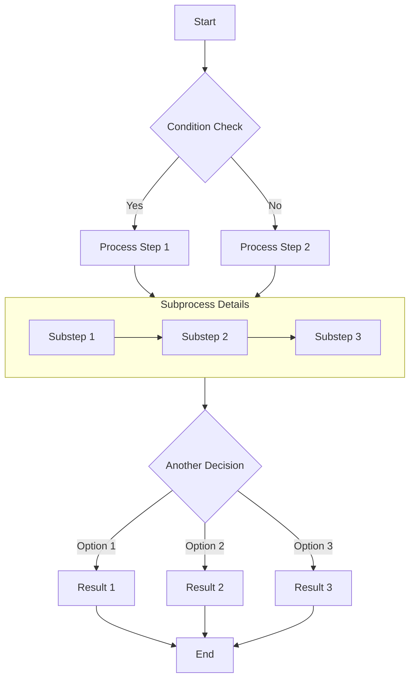
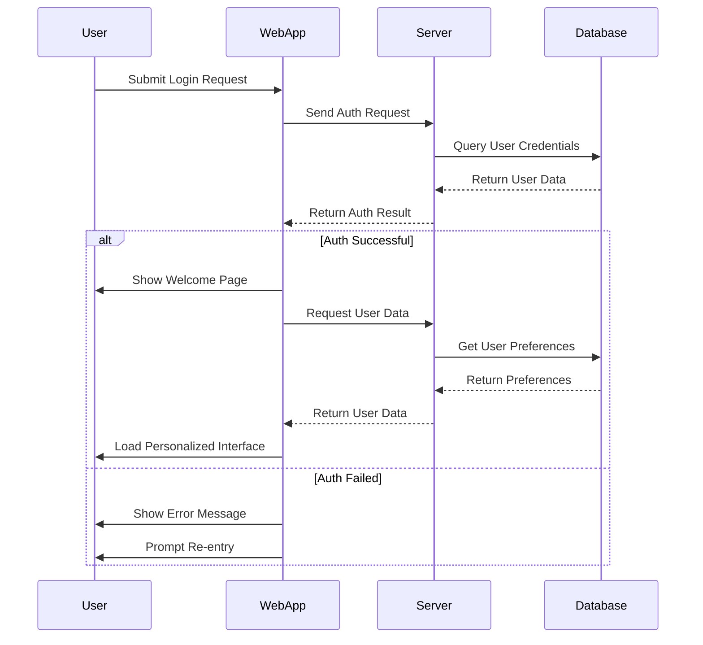
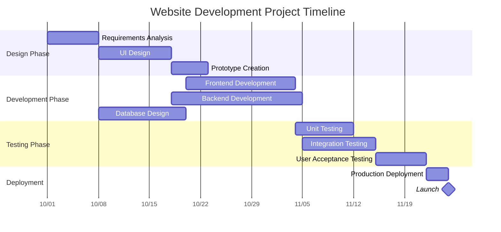
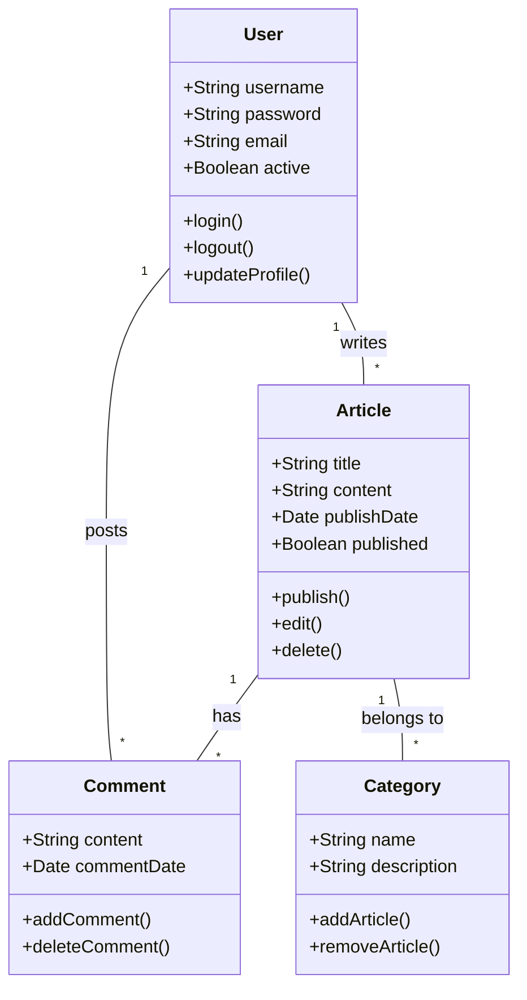
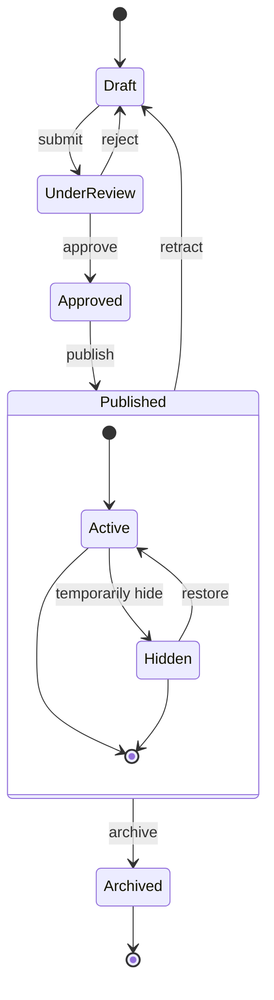
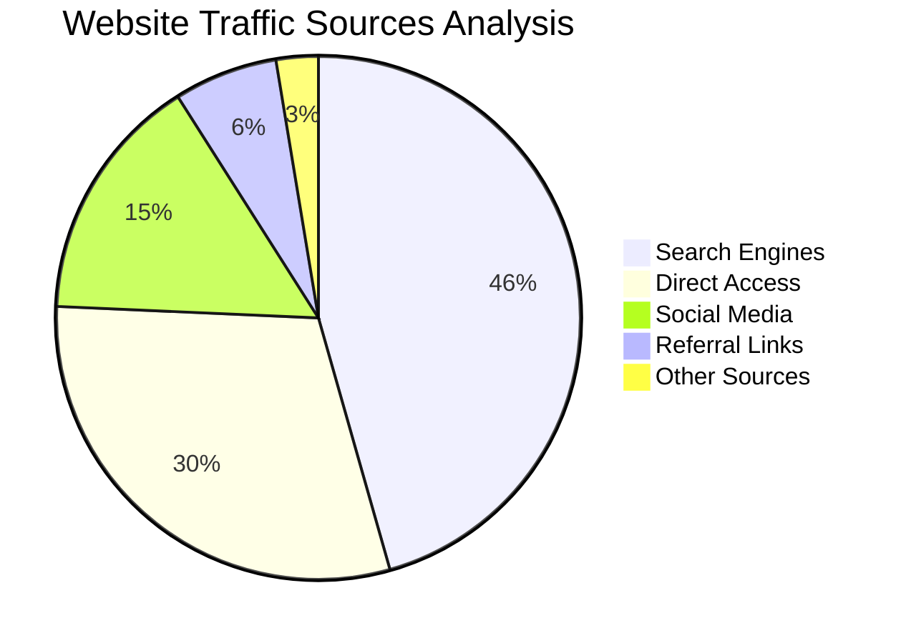

# Markdown Mermaid 图表示例

本文演示如何在 Markdown 文档中使用 Mermaid 创建流程图、时序图、甘特图、类图和状态图。

## 流程图示例

流程图适合表示业务流程或算法步骤。

## 时序图示例

Sequence diagrams show interactions between objects over time.

## 甘特图示例

Gantt charts are perfect for displaying project schedules and timelines.

## 类图示例

Class diagrams show the static structure of a system, including classes, attributes, methods, and their relationships.

## 状态图示例

State diagrams show the sequence of states an object goes through during its life cycle.

## 饼图示例

饼图适合展示占比和百分比数据。

## 总结

Mermaid 是一个适合在 Markdown 文档中绘制图表的工具。本文展示了流程图、时序图、甘特图、类图、状态图和饼图的基本写法。

使用时只需要在代码块中指定 `mermaid` 语言，并用简洁的文本语法描述图表结构，Mermaid 会自动渲染为可视化图表。

在技术博客或项目文档中使用 Mermaid，可以让流程、结构和关系表达得更清晰。
